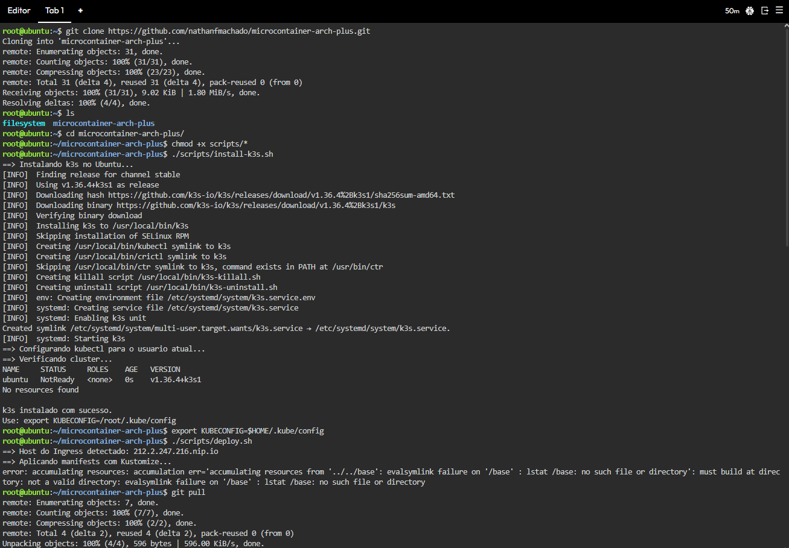
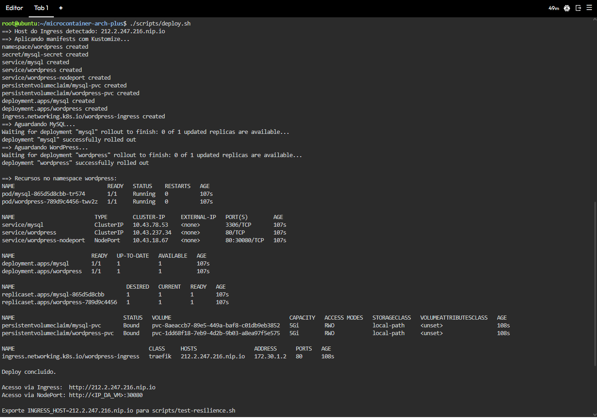
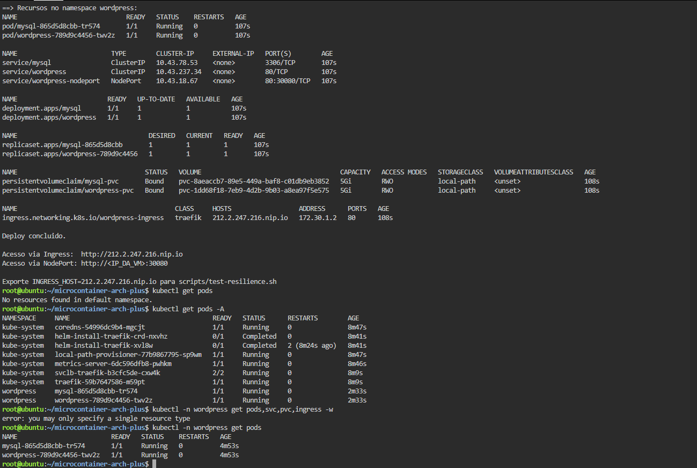
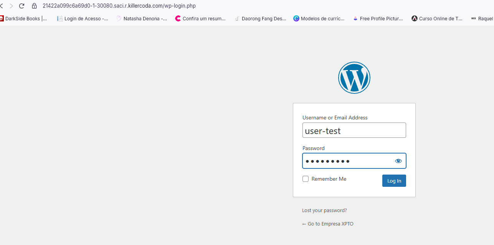
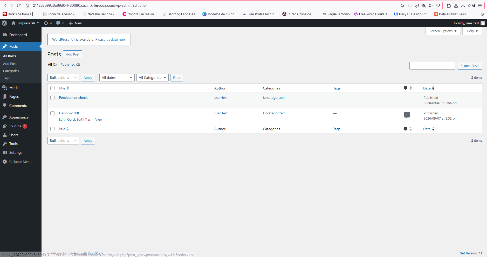
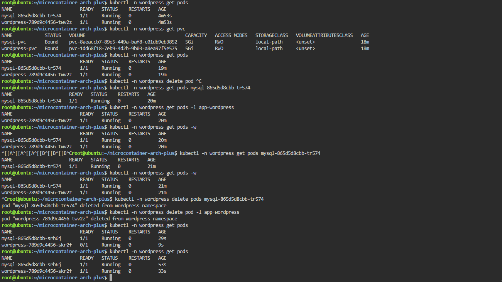
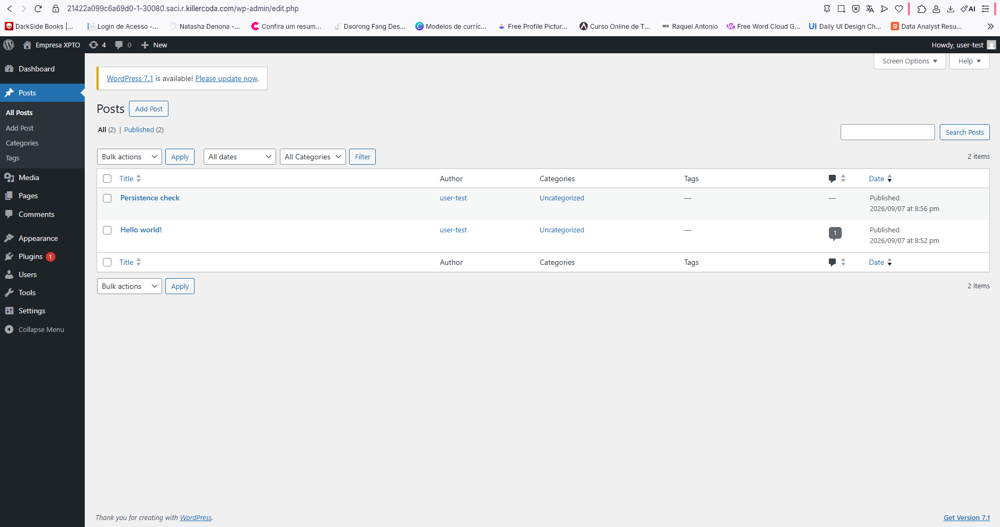

# WordPress + MySQL no Kubernetes (k3s)

Provisionamento de WordPress e MySQL em containers gerenciados pelo Kubernetes, com persistencia de dados. Este guia usa o playground **Ubuntu** do [Killercoda](https://killercoda.com/playgrounds).

## Arquitetura

```
Usuario (Marketing)
        |
        v
   NodePort (:30080) via Traffic/Ports do Killercoda
        |
        v
   Service wordpress:80
        |
        v
   Pod WordPress  --->  PVC wordpress-pvc (/var/www/html)
        |
        v
   Service mysql:3306
        |
        v
   Pod MySQL  --->  PVC mysql-pvc (/var/lib/mysql)
```

Ambos os pods usam o StorageClass `local-path` (incluso no k3s). Ao deletar um pod, o Deployment recria a replica e remonta o mesmo PVC, preservando dados e configuracoes.

## Pre-requisitos

- Conta gratuita no Killercoda
- Playground **Ubuntu** aberto no navegador
- Repositorio publico no GitHub com este projeto

## Estrutura do projeto

```
microcontainer-arch-plus/
├── README.md
├── docs/images/              # Screenshots do relatorio (ver docs/images/README.md)
├── k8s/
│   ├── base/                 # Manifests base
│   └── overlays/local/       # Overlay Kustomize
└── scripts/
    ├── install-k3s.sh
    ├── deploy.sh
    └── test-resilience.sh
```

Os screenshots de cada passo estao documentados em [`docs/images/README.md`](docs/images/README.md).

---

## Passo 1 — Abrir o ambiente e clonar o projeto

1. Acesse [killercoda.com/playgrounds](https://killercoda.com/playgrounds) e abra o playground **Ubuntu**.
2. No terminal:

```bash
sudo apt update && sudo apt upgrade -y
sudo apt install -y curl git

git clone https://github.com/nathanfmachado/microcontainer-arch-plus.git
cd microcontainer-arch-plus
chmod +x scripts/*.sh
```

---

## Passo 2 — Instalar o k3s

```bash
./scripts/install-k3s.sh
export KUBECONFIG=$HOME/.kube/config
```

Verifique o cluster:

```bash
kubectl get nodes
kubectl get storageclass
```

Resultado esperado: no com status `Ready` e StorageClass `local-path` disponivel.



---

## Passo 3 — Ajustar credenciais (opcional)

Edite [`k8s/base/mysql/secret.yaml`](k8s/base/mysql/secret.yaml) e altere as senhas antes do primeiro deploy:

- `MYSQL_ROOT_PASSWORD`
- `MYSQL_PASSWORD`

---

## Passo 4 — Deploy da stack WordPress + MySQL

```bash
./scripts/deploy.sh
```

O script aplica os manifests com Kustomize e aguarda os Deployments `mysql` e `wordpress` ficarem prontos.

Acompanhe os recursos:

```bash
kubectl -n wordpress get pods,svc,pvc,ingress -w
```

Resultado esperado:

| Recurso | Status |
|---------|--------|
| `pod/mysql-*` | `Running` |
| `pod/wordpress-*` | `Running` |
| `pvc/mysql-pvc` | `Bound` |
| `pvc/wordpress-pvc` | `Bound` |





---

## Passo 5 — Acessar o WordPress (simulacao Marketing)

No Killercoda o acesso ao site e feito pelo proxy de portas da plataforma, nao pelo IP da VM.

1. No canto superior direito do terminal, abra **Traffic / Ports**.
2. Em **Custom Ports**, informe `30080` e clique em **Access**.
3. O navegador abrira uma URL temporaria do Killercoda apontando para o WordPress.

> Dica: no terminal, `sed 's/PORT/30080/g' /etc/killercoda/host` gera a mesma URL. Para testes com `curl` dentro da VM, use `http://localhost:30080`.



### Configuracao pelo time de Marketing

1. Selecione idioma **Portugues (Brasil)**
2. Preencha titulo do site (ex.: "Empresa XYZ")
3. Crie usuario administrador e senha
4. Instale um tema e publique uma pagina de teste (ex.: "Bem-vindo ao site da empresa")
5. Acesse `wp-admin` e confirme que o conteudo foi salvo



---

## Passo 6 — Teste de resiliencia

Simula a perda dos pods WordPress e MySQL para validar persistencia. Antes de iniciar, confirme que ha conteudo publicado no passo 5.

```bash
kubectl -n wordpress get pvc

kubectl -n wordpress delete pod -l app=wordpress
kubectl -n wordpress delete pod -l app=mysql

kubectl -n wordpress rollout status deployment/mysql --timeout=300s
kubectl -n wordpress rollout status deployment/wordpress --timeout=300s
kubectl -n wordpress get pods
```

Valide no terminal:

```bash
curl -I http://localhost:30080
```

Ou com o script:

```bash
export TEST_URL=http://localhost:30080
./scripts/test-resilience.sh
```

Valide no navegador: abra novamente **Traffic / Ports → 30080 → Access** e confirme que o site, o login no `wp-admin` e o conteudo publicado continuam disponiveis.





---

## Mapa dos arquivos Kubernetes

| Arquivo | Recurso K8s | Finalidade | Ordem |
|---------|-------------|------------|-------|
| `k8s/base/namespace.yaml` | Namespace | Isola recursos em `wordpress` | 1 |
| `k8s/base/mysql/secret.yaml` | Secret | Credenciais MySQL/WordPress | 2 |
| `k8s/base/mysql/pvc.yaml` | PVC | Persistencia do banco | 3 |
| `k8s/base/mysql/deployment.yaml` | Deployment | Pod MySQL 8.0 (strategy Recreate) | 4 |
| `k8s/base/mysql/service.yaml` | Service | MySQL interno ClusterIP :3306 | 5 |
| `k8s/base/wordpress/pvc.yaml` | PVC | Persistencia do WordPress | 6 |
| `k8s/base/wordpress/deployment.yaml` | Deployment | Pod WordPress + initContainer | 7 |
| `k8s/base/wordpress/service.yaml` | Service | WordPress ClusterIP :80 | 8 |
| `k8s/base/wordpress/service-nodeport.yaml` | Service | NodePort :30080 | 9 |
| `k8s/base/ingress.yaml` | Ingress | Exposicao HTTP via Traefik | 10 |
| `k8s/base/kustomization.yaml` | Kustomize | Empacota recursos base | — |
| `k8s/overlays/local/kustomization.yaml` | Kustomize | Overlay para ambiente local | — |
| `k8s/overlays/local/ingress-patch.yaml` | Patch | Ajusta host do Ingress | — |
